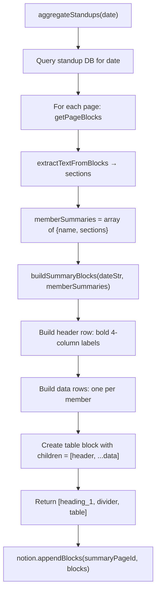

# Design: Summary Table Format

## Overview

The standup summary is converted from a toggle + bullet format to a Notion table format by replacing the existing `buildSummaryBlocks` function's loop logic. The function will:

1. Keep the `heading_1` and `divider` blocks unchanged
2. Build a table block with 4 columns (table_width: 4) and has_column_header: true
3. Add a header row with bold column labels
4. Add one data row per team member
5. Highlight Blocker cells in red when they contain content
6. Display `(chuwa điền)` in empty cells

The rest of the standup workflow (`extractTextFromBlocks`, `getMemberName`, `aggregateStandups`) remains unchanged because the input (parsed member summaries) and output (Notion blocks to append) shapes are already compatible.

## Architecture / Data Flow



## Components Changed

| File | Change Type | Description |
|------|-------------|-------------|
| `src/services/summary.js` | modify | Replace toggle loop with table logic in `buildSummaryBlocks` function |
| `src/services/summary.js` | add | Add private helper `buildRichText(content, {bold, color})` |
| `src/services/summary.js` | add | Add private helper `buildTableRow(cells)` |
| `src/__tests__/summary.service.test.js` | modify | Replace toggle-focused tests with table-focused tests for `buildSummaryBlocks` |

## Interface Definitions

### `buildRichText(content, options)`
```javascript
// Creates a single rich-text element for Notion blocks
// Input:
//   content: string — text to display
//   options: { bold?: boolean, color?: 'default'|'red'|... } — formatting
// Output: { type: 'text', text: { content }, annotations: { bold, color } }
```

### `buildTableRow(cells)`
```javascript
// Creates a single table_row block from an array of cells
// Input:
//   cells: Array<Array<RichText>> — each cell is an array of rich-text elements
// Output: { object: 'block', type: 'table_row', table_row: { cells } }
```

### `buildSummaryBlocks(dateStr, memberSummaries)` — modified
```javascript
// Input:
//   dateStr: string — formatted date for the heading
//   memberSummaries: Array<{ name: string, sections: {key: string[]} }>
// Output:
//   Array of Notion blocks: [heading_1, divider, table]
//   - table.table_width = 4
//   - table.has_column_header = true
//   - table.children = [headerRow, ...dataRows]
```

## Data Models

### Table Structure
```
[
  { type: 'heading_1', ... },
  { type: 'divider', ... },
  {
    type: 'table',
    table: { table_width: 4, has_column_header: true, has_row_header: false },
    children: [
      // Header row
      { type: 'table_row', table_row: { cells: [
          [{ type: 'text', text: { content: 'Thành viên' }, annotations: { bold: true } }],
          [{ type: 'text', text: { content: 'Hôm qua' }, annotations: { bold: true } }],
          [{ type: 'text', text: { content: 'Hôm nay' }, annotations: { bold: true } }],
          [{ type: 'text', text: { content: 'Blocker' }, annotations: { bold: true } }],
      ]}},
      // Data rows (one per member)
      { type: 'table_row', table_row: { cells: [
          [{ type: 'text', text: { content: name } }],
          [{ type: 'text', text: { content: homQua } }],
          [{ type: 'text', text: { content: homNay } }],
          [{ type: 'text', text: { content: blocker }, annotations: { color: 'red' or 'default' } }],
      ]}},
      ...
    ]
  }
]
```

## Integration Points

- **Callers**: `aggregateStandups` in the same file — no changes needed because it already calls `buildSummaryBlocks(dateStr, memberSummaries)` and passes the result to `notion.appendBlocks()`
- **Dependencies**: 
  - `@notionhq/client` library (used transitively via `notion.appendBlocks`)
  - `extractTextFromBlocks`, `getMemberName` — no changes
  - `formatDate` from `dailyStandup.js` — no changes

## Error Handling

- **Empty summaries**: If `memberSummaries` is an empty array, the table still renders with a header row and zero data rows (no error).
- **Large teams**: If memberSummaries.length > 99, Notion API's 100-child limit is approached but not exceeded for a table (table has 1 header + N data rows, so max 100 members requires 101 children; in practice, teams are much smaller). Document this constraint.
- **Malformed sections**: If a section is missing or undefined, fallback to empty array `[]`, which produces `(chưa điền)` text. No runtime errors.

## Open Questions

- [ ] Should blockers be joined with `\n` the same way as other sections, or should they preserve line breaks differently?
- [ ] Is there any preference for table styling (border, background colors) via Notion's API, or is default styling acceptable?
