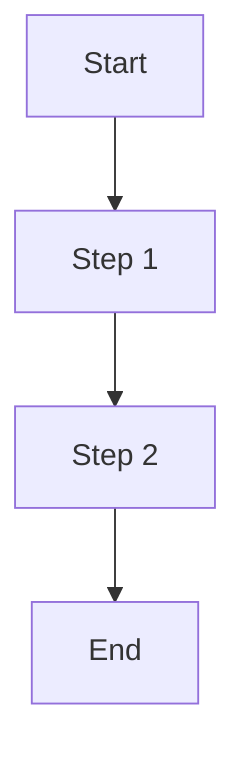

# Design: [Feature Name]

## Overview

[Technical summary of how this feature will be implemented. What is the high-level approach? What existing patterns will it reuse? What new patterns does it introduce?]

## Architecture / Data Flow



(Replace with your feature's actual flow. Show data movement, system interactions, or process steps.)

## Components Changed

| File | Change Type | Description |
|------|-------------|-------------|
| src/path/file.js | modify | Brief description of what changes |
| src/path/file.js | create | Brief description of new file purpose |
| src/path/file.js | delete | Brief description of what is removed |

## Interface Definitions

### Functions
```javascript
// Function name and signature
function doSomething(param1, param2) {
  // input: param1 (type), param2 (type)
  // output: returns (type) with properties or behavior
}
```

### Data Models
[Describe the shape of key data structures: objects, arrays, enums, etc.]

## Integration Points

- **How does this feature connect to existing systems?** [e.g., database, authentication, API gateway]
- **What modules does it depend on?** [e.g., existing services, utilities]
- **What will call this feature?** [e.g., route handler, scheduled job, other module]

## Error Handling

- [What errors are expected and how they are handled]
- [Fallback behavior if a critical system fails]
- [User-facing error messages or logging strategy]

## Open Questions

- [ ] [Unresolved technical decision or design question]
- [ ] [Blocked by external dependency or awaiting clarification]
